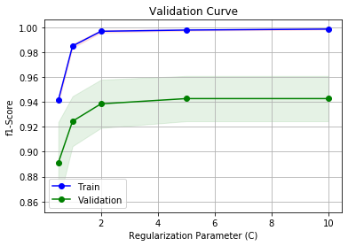
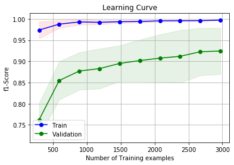

# Email-Spam
Using scikit-learn SVM classifier, an email spam classifier is trained and tested on SPAM ASSASSIN public corpus
(https://spamassassin.apache.org/old/publiccorpus/)

This public source contains 3 sets of emails: easy_ham, hard_ham, and spam

The first two sets of emails (easy_ham and hard_ham) overall contain 3300 non-spam emails and spam folder has 500 spam emails.

In the first step, the emails are imported into Python and normalized as below:
- any punctuations are removed
- all the characters in the emails are lower-cased
- email addresses are replaced by "emailaddr" string
- URL addresses are substituted by "urladdr" string
- all the numbers are replaced by "number" string
- $ sign is replaced by "dollar" string

##
In the second step, the pre-processed emails and their labels are combined together and using CountVectorizer from scikit-learn library in Python, a sparse matrix of token counts using single words in the emails are produced.
Here, we are ignoring 5% the tokens with the highest and lowest frequencies.
This provides us with a sparse matrix of size (3302, 564) that acts as our training example set.

##
Using our training examples, we develop a validation curve to obtain an optimum regularization parameter (C) for our SVM classifier.

Based on this curve, the choice of C=2.0 should suffice since it has a high mean f1-score and also low f1-score standard deviation.

##
Furthermore, we obtain a learning curve to check if obtaining additional training examples could increase the performance of our classifier.

This curve suggests that obtaining extra training examples can improve the performance of our SVM classifier.

##
Now, the cross-validation score of our SVM classifier is obtained using Stratified K-fold Cross-Validation (K=10).

svm cross validation f1-score:
[0.93877551 0.9010989  0.95833333 0.94736842 0.97959184 0.94736842
0.95833333 0.91304348 0.92473118 0.77419355]

svm cross validation mean f1-score:
0.9242837966253272

svm cross validation std f1-score:
0.05463030078743098

##
Finally, after checking the performance of our classifier, an SVM classifier is trained over all the training examples available and saved.
